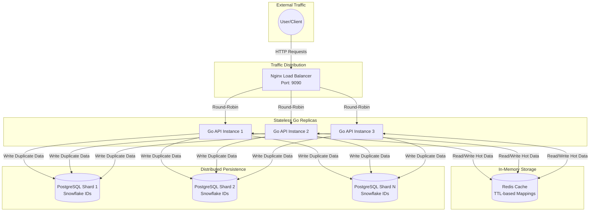

# Shourty - Scalable URL Shortener

This project is an educational experiment to demonstrate a highly scalable, distributed URL shortener architecture. It implements advanced patterns like load balancing, caching, and distributed ID generation.

## Features

- **Core Functionality**: Takes a long URL and generates a unique short alias using **Base62** encoding.
- **Simple Schema**: Minimalist database design focusing purely on URL mapping.
- **No Analytics**: Deliberately excludes statistical tracking (click rates, geoa-data) to prioritize simplicity.
- **Scalable Design**: Demonstrating distributed systems patterns like sharding and eventual consistency.

## Architecture

1.  **Load Balancer (Nginx)**: Distributes traffic across 3 API replicas using a Round-Robin strategy. Exposed on port `9090`.
2.  **API Layer (Go)**: Stateless Go servers that handle business logic.
3.  **Caching Layer (Redis)**: Stores hot URL mappings using **TTL-based caching** (Time-To-Live) to minimize database hits and manage memory usage.
4.  **Storage Layer (PostgreSQL)**: Durable storage using time-sortable Snowflake IDs. The architecture uses **sharding** and explicitly allows **data duplication** to avoid expensive global uniqueness checks (replacing the previous Bloom Filter approach).

## Prerequisites

- Docker and Docker Compose (recommended)
- Go 1.25+ (for local development)

## Quick Start (Recommended)

Run the entire distributed stack (Nginx, 3 App Instances, Redis, Postgres) with Docker Compose:

```bash
docker compose up --build -d
```

The application will be available at **`http://localhost:9090`**.

## Manual Setup (Local Dev)

If you want to run the Go application locally against Dockerized services:

1.  **Start Dependencies (DB & Redis)**:
    ```bash
    docker compose up -d postgres redis
    ```

2.  **Configure Environment**:
    ```bash
    cp .env.example .env
    # Ensure DATABASE_URL and REDIS_ADDR match your local ports
    ```

3.  **Run the App**:
    ```bash
    go run cmd/api/main.go
    ```
    (Runs on `http://localhost:8080`)

## API Usage

All examples assume you are running via Docker Compose on port `9090`.

### Shorten a URL

```bash
curl -X POST http://localhost:9090/shorten \
  -H "Content-Type: application/json" \
  -d '{"long_url": "https://www.google.com"}'
```

**Response:**
```json
{
  "short_url": "http://localhost:9090/2odwvq5DM6Q"
}
```

### Access a URL

Visit the link in your browser or curl it:

```bash
curl -v http://localhost:9090/2odwvq5DM6Q
```

## Database Schema

We use **Snowflake IDs** instead of standard auto-incrementing integers. This allows for distributed ID generation without coordination.

```sql
CREATE TABLE urls (
    id BIGINT PRIMARY KEY,              -- Snowflake ID (64-bit)
    long_url TEXT NOT NULL UNIQUE,
    short_url VARCHAR(20) UNIQUE,       -- Base62 encoded Snowflake ID
    created_at TIMESTAMP WITH TIME ZONE DEFAULT CURRENT_TIMESTAMP
);
```

## Project Structure

```
shourty/
├── cmd/
│   └── api/             # Application entrypoint
├── internal/
│   ├── base62/          # Base62 encoder/decoder
│   └── storage/         # Postgres & Redis implementations
├── nginx/               # Nginx configuration
├── docker-compose.yml   # Stack definition
├── Dockerfile           # API Dockerfile
├── Dockerfile.postgres  # Custom Postgres Dockerfile (Schema & Config)
├── init.sql             # SQL Schema
├── .env.example         # Environment variables template
└── README.md            # Documentation
```

## License

MIT
